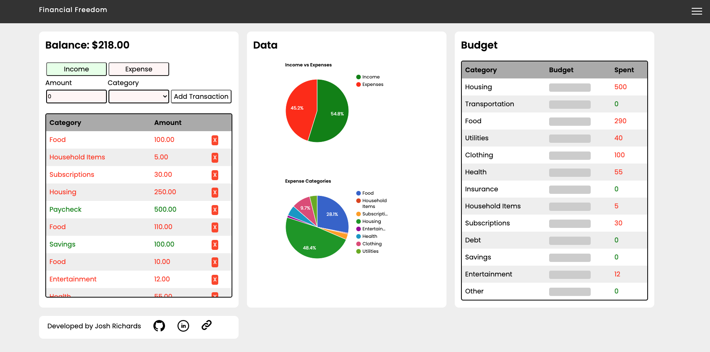

# Full Stack Budgeting Web Application



## Technologies

- React for the frontend framework.
- Typescript for the Javascript syntax.
- Custom CSS for the styling.
- Django REST Framework for the server side.
- Python for the server side language.
- SQLite for the database.

## Current Functionality

- Simple hard coded Login Page
- Adding a transaction
- Deleting a transaction
- Auto updating your balance based on the sum of the transactions in your account
- Displaying Pie Charts that show
  - Income vs Expenses
  - Expense Category Comparison
- A budget where you set how much you want to spend on a category and it will compare it to how much you've actually spent on that category.
- Can plug and play with the sections that you want. If you click on the NavBar items it will remove/add them to the screen.

I will be expanding the functionality in the future.

## Set-up on your Machine

1. Clone the project to your machine ```[git clone https://github.com/joshuarichards001/budgeting-web-app.git]```
2. Navigate into the diretory ```[cd budgeting-web-app]```
3. Source the virtual environment ```[pipenv shell]```
4. Install the dependencies ```[pipenv install]```
5. Navigate into the frontend directory ```[cd frontend]```
6. Install the dependencies ```[npm install]```

Then to run this application you will need to perform the following in two separate terminals:

1. In the first terminal go into backend ```[cd backend]``` and run ```[python3 manage.py runserver]```
2. In the second terminal go into frontend ```[cd frontend]``` and run ```[npm start]```

## Application in Action


